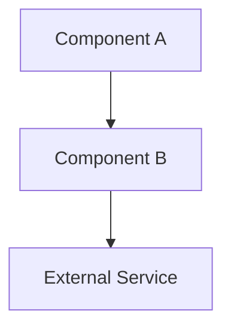
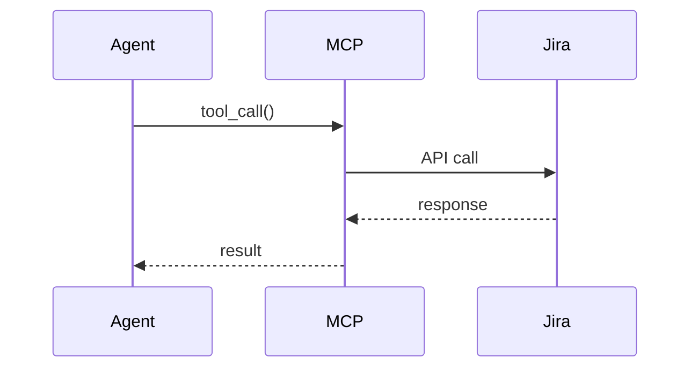

# Design Document Format

Khi sinh design document (cho Shape flow hoặc Kiro spec), PHẢI tuân theo format sau.

## Cấu trúc bắt buộc

```markdown
# Design Document — [Tên Feature]

## Overview
- Tóm tắt scope, mục tiêu
- Liệt kê components/tools mới
- Nguyên tắc thiết kế (design principles)
- Design decisions table (quyết định + lý do)

## Architecture
- Mermaid diagram tổng thể (component/graph diagram)
- Sequence diagram cho flow chính

## Components and Interfaces
- Files mới (table: file path + trách nhiệm)
- Files sửa đổi (table: file path + thay đổi)
- Files giữ nguyên (reuse, không thay đổi)
- Interface signatures (Python code blocks với type hints + docstrings)

## Data Models
- Dataclass definitions (Python code blocks)
- Response shapes (JSON examples cho success + error)
- Config changes (Settings fields mới)

## Correctness Properties
- Formal properties cho property-based testing
- Mỗi property: mô tả + validates requirements nào

## Error Handling
- Error table: tình huống + error key + HTTP code + hành động
- Error response contract (format chung)

## Testing Strategy
- Unit test plan (example-based)
- Property-based test plan (hypothesis)
- Integration test plan (nếu có)
```

## Mermaid Diagrams — Bắt buộc

Mỗi design document PHẢI có ít nhất:

1. **Architecture diagram** — component relationships


2. **Sequence diagram** — flow chính


## Design Decisions Table

Mỗi quyết định kiến trúc quan trọng phải document:

| Quyết định | Lý do |
|---|---|
| Tạo file riêng thay vì thêm vào file cũ | Tách biệt concern, dễ maintain |
| Reuse module X thay vì viết mới | Đã có logic, đã test, không duplicate |

## Interface Signatures

Viết đầy đủ type hints + docstring:

```python
@dataclass(slots=True)
class ResultModel:
    field_a: str
    field_b: int
    trace_id: str

class ServiceClass:
    def __init__(self, dep: Dependency) -> None: ...

    def method(self, param: str) -> ResultModel:
        """Mô tả method. Nêu rõ side effects nếu có."""
        ...
```

## Correctness Properties Format

```markdown
### Property N: Tên property

*For any* [input domain], when [condition], [component] SHALL [behavior].
*For any* [input domain], [invariant] SHALL hold.

**Validates: Requirements X.Y, Z.W**
```

## Ví dụ tham khảo

Dưới đây là ví dụ rút gọn từ các spec đã hoàn thành trong dự án AI Context Engine.

### Ví dụ 1: Design Decisions Table

```markdown
| Quyết định | Lý do |
|---|---|
| Thin wrapper over D3 ship tools | AMS Ship Engine chỉ thêm gate validation + fast-track soak time, không duplicate D3 logic |
| Audit-based state resolution | Không cần state table riêng — audit log là source of truth cho incident state |
| Jira transition best-effort | State change vẫn succeed trong audit nếu Jira transition name không match |
| Escalation fire-and-forget | Server không chạy timer — client LLM quyết định khi nào gọi escalate |
```

### Ví dụ 2: Dependency Map Table

```markdown
| Function | Jira APIs | D3 Ship Tools | HITL Gate | Webhook | AMS Gates | Audit |
|----------|-----------|---------------|-----------|---------|-----------|-------|
| `ship_hotfix` | `jira_get_issue` | `trigger_ci` / `promote_uat` / `promote_prod` | — | — | `pre_deploy_gate` | `write_audit` |
| `transition_incident` | `jira_get_transitions`, `jira_transition` | — | — | — | gate prerequisite check | `write_audit` |
| `escalate_incident` | `jira_get_issue`, `jira_add_comment` | — | — | `alert_webhook_url` | — | `write_audit` |
```

### Ví dụ 3: Correctness Property

```markdown
### Property 4: Invalid state transitions are rejected

*For any* pair of IncidentState values (from_state, to_state) where the
pair is NOT in ALLOWED_TRANSITIONS, calling transition_incident SHALL
return AMSTransitionResult with transition_allowed=False. Conversely,
*for any* pair that IS in ALLOWED_TRANSITIONS (and gate prerequisites
are met), the transition SHALL be allowed.

**Validates: Requirements 4.2, 4.3, 5.1**
```

### Ví dụ 4: Graceful Degradation Table

```markdown
| Condition | Behavior |
|-----------|----------|
| Jira transition name not found | State change succeeds in audit, jira_transition_status="not_found" |
| Webhook POST fails | Escalation continues, webhook_sent=False, warning logged |
| Jira comment fails | Operation continues, jira_notified=False, warning logged |
| Audit log read fails | Default to "New" state, warning logged |
```
